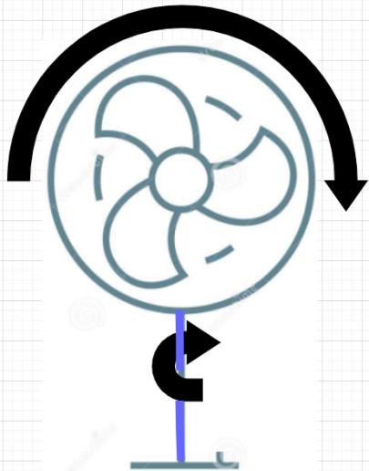
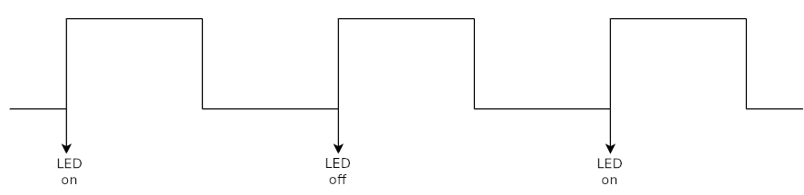
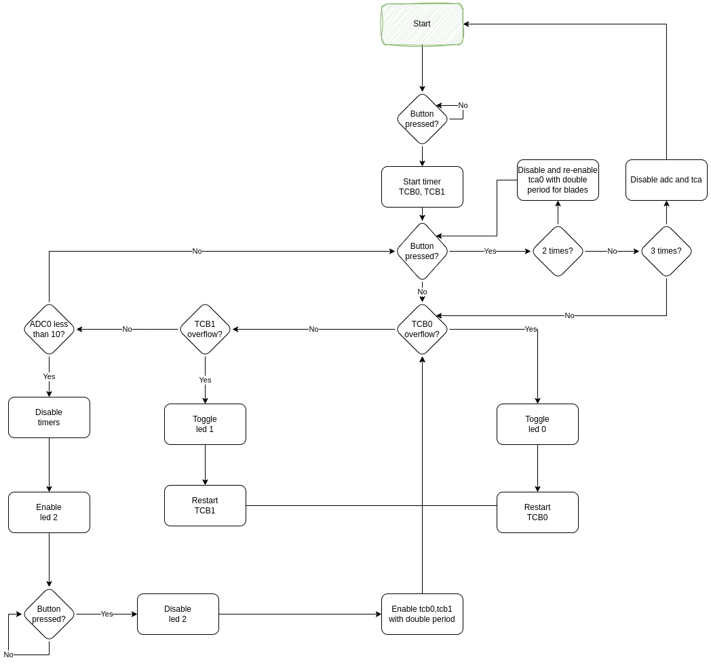

# Fan Simulation

## Purpose
In this laboratory exercise, the motion of a fan will be simulated. A fan consists of two rotational movements: a circular motion of the blades and a circular motion of the base, allowing the fan to rotate and cover more space, as depicted below:

These two circular movements will be simulated with two different rates, determined by two separate Pulse-Width Modulators (PWMs) (you can use any register that suits you). The rate of each movement will be visualized through two LEDs (LED0 and LED1), which will be activated when the pulse is in the rising edge and deactivated when the rising edge of the next pulse follows, as illustrated below:

## Flowchart

## Implementation Details
- Circular motion of the base is activated, simulated with a pulse period Tb = 2 ms and a duty cycle Db = 40%. This pulse drives LED1 of PORTD through rising edges.
- Circular motion of the blades is activated, simulated with a pulse period Tl = 1 ms and a duty cycle Dl = 50%. This pulse drives LED0 of PORTD through rising edges.
- The Analog to Digital Converter (ADC) is activated. When it detects a value below a predefined threshold, indicating an object is close to the rotating blades, the fan is immediately deactivated, and a third LED (LED2 of PORTD) is activated.
- To restart the fan, the switch (switch 5 of PORTF) must be activated again, and LED2 of PORTD must be deactivated.

When the same switch (switch 5 of PORTF) is activated for the second time after the fan has started, the period of the pulse for the circular motion of the blades is doubled with a duty cycle Tl = 50%. The ADC and the pulse for the circular motion of the base continue their operation as described above. If this switch is pressed a third time, the fan is deactivated, and both pulses along with the ADC stop their operation.
