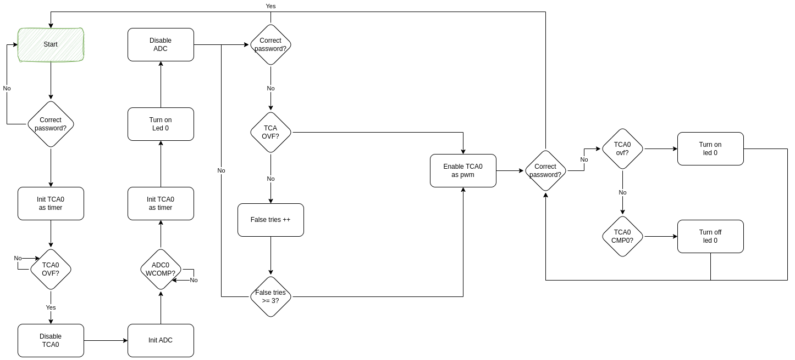

# Smart Alarm System

## Purpose
This lab exercise implements an intelligent alarm system that provides security to the operating space. The alarm system consists of four components serving different functions:

1. A distance calculation sensor, serving as the input to the Analog to Digital Converter (ADC).
2. A timer element.
3. Two switches that function as the keyboard for entering the code to enable or disable the alarm.
4. A Pulse-Width Modulator (PWM) that activates the alarm siren.

The alarm system comprises two functions: the activation function and the deactivation function.

### Activation Function
The activation function is called to enable the alarm and secure the area. Specifically, when someone enters the predefined four-digit combination through the keyboard (two switches of PORTF), the activation function is invoked. This combination is a sequential activation of switches SW5 and SW6 of PORTF with a predefined sequence. The combination consists of the activation of SW5, followed by SW6, then SW5 again, and finally SW6. Once the combination is correctly entered, a timer is started (simulated with any timer/counter of your choice), allowing occupants time to leave the room, lock the doors, and activate the second function of the alarm.

### Deactivation Function
The deactivation function is called when someone is detected entering the secured area via the distance sensor. When the ADC value falls below a threshold, indicating an intrusion, an LED (LED0) is activated. The alarm then requires the correct entry of the predefined four-digit combination (the sequence SW5-SW6-SW5-SW6) within a limited time frame. The ADC initiates a timer that runs for a specified duration during which the correct code must be entered up to three times. If the correct combination is entered within the time frame with fewer than three attempts, the alarm is deactivated, and the first function is called again. If the time frame expires without the correct combination or if an incorrect combination is entered three times, the siren is activated.

The siren is simulated by driving the LED (LED0) through a PWM pulse. The LED is activated on the rising edge of the pulse and deactivated on the falling edge. To stop the siren and deactivate the alarm (triggering the first function), the correct combination must be entered again.

Note: If any digit is entered incorrectly during the combination entry process, the alarm will require the entire combination to be entered again from the beginning.

## Flowchart

## Implementation Details
### Hardware Components
- Distance Calculation Sensor
- Timer/Counter (for simulation)
- Two Switches (SW5 and SW6 of PORTF)
- Analog to Digital Converter (ADC)
- Pulse-Width Modulator (PWM)
- LED (LED0 of PORTD)
