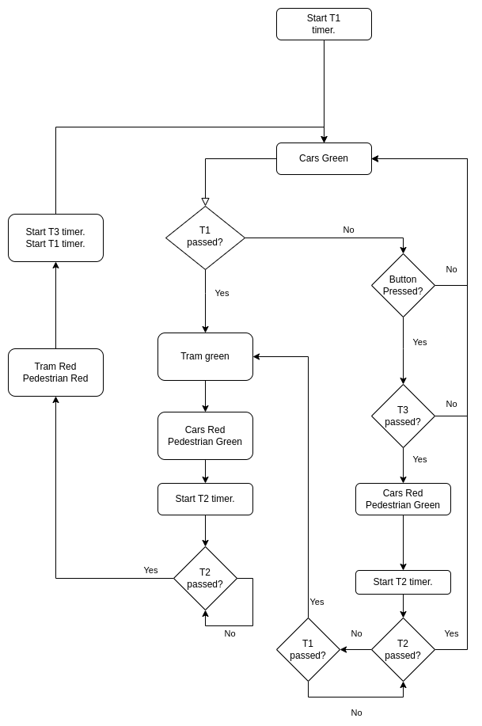

# Traffic Simulation

## Purpose
The goal of this laboratory exercise is to simulate the operation of a highway intersection, consisting of a main road and a perpendicular railway. The main road is equipped with traffic lights for vehicles and pedestrians, with the pedestrian light only activated after pressing a push button. A tram passes through the railway at regular intervals, interrupting normal traffic flow. During this time, the traffic light for the main road turns red, and the pedestrian light turns green for a specific duration. Additionally, pressing the pedestrian button turns the vehicle light red for the main road, along with the pedestrian light, for the same duration. To press the pedestrian button again, a time interval must elapse. If the pedestrian light is already active, the operation is not interrupted, and active time intervals are maintained until completion.

## Flowchart

## Implementation Details
- The traffic light is green when the LED is on (logical '0') and red when it is off (logical '1'). The three PINs of PORTD used are PIN0, PIN1, and PIN2. The LED corresponding to the tram (PIN1) is activated when the tram passes the railway and deactivated otherwise.
- The button press for pedestrians is implemented using an interrupt. PIN5 of PORTF is used for this purpose.
- The TCA0 timer/counter can be split into two 8-bit timers/counters using the TCA0.SPLIT command. One of them is used for the time intervals T2 and T3, while the other is used for the time interval T1, defining when the tram passes through the railway.

Feel free to set the time units according to your convenience for simulation and explain the thought process and calculation method for the values.
